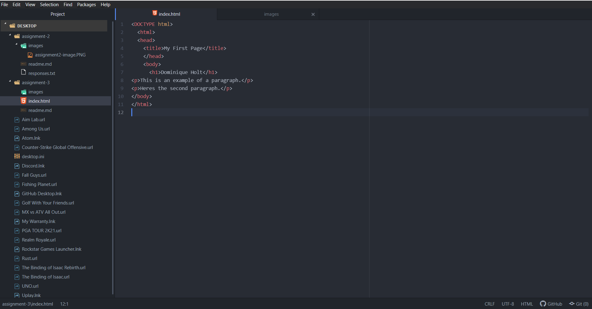

1. Browsers work as translators which takes the information that you requested and displays it as a proper web page. They contain elements such as rendering engines which organize the information in order and displays the proper images. I currently use google chrome.

2. Markup language decides the structure of the page, specifically the text design. HTML or hypertext markup language was the first markup language. It uses tags to determine the style and use of specific sections of the text. It is consistent across all devises and does not require updates..

