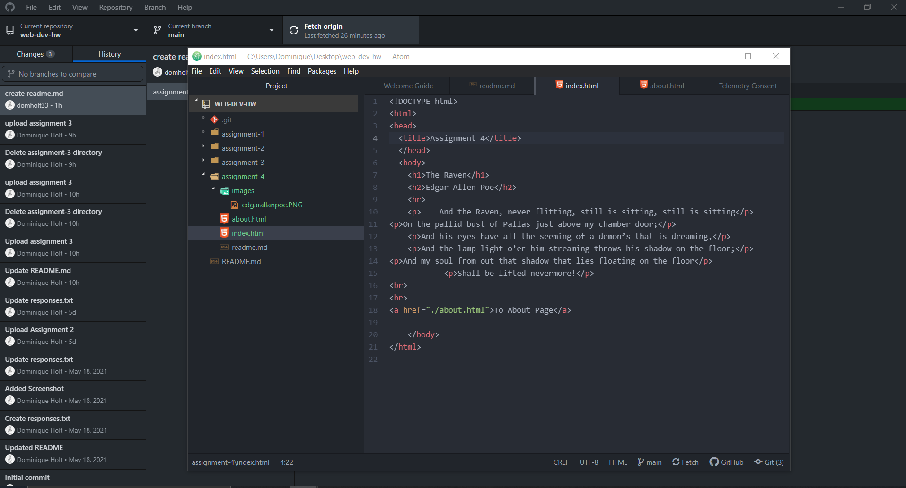

# Assignment 4
1. Using the wayback machine I took a look at the old Youtube site from ten years ago. The page was relatively colorless other than the thumbnails for the videos and the page set up was in the standard page layout rather than landscape. Now the page is landscape style and has a color background with a fixed menu that stays on the page as you scroll.
2. With the git module, I learned how much easier it can be to use the desktop app to make changes. I had actually mad a mistake early on the would have been fixable using the app. This mad the entire process much easier and time efficient.
3. 
